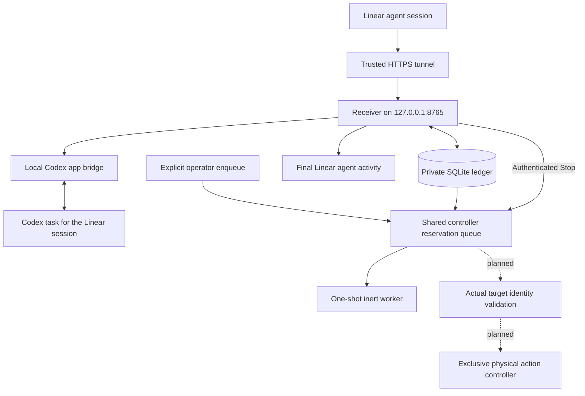

# FarmQA architecture and durable memory

Status date: 2026-09-17. Source baseline: `main` at `7217880`, after PRs #6
and #7 merged. This is the consolidated reference for the user-approved design;
it does not authorize new gameplay or broaden the boundaries in [CLAUDE.md](../CLAUDE.md).

## Purpose and current scope

FarmQA is a private Linear agent named exactly **FarmQA**, mentioned as
**@FarmQA**. Its first fixed-reply connection test passed. Current chat requests
are forwarded to Codex desktop tasks and the exact final response is returned
as a Linear agent activity. These replies can appear inside the Linear agent
chat; there is no separate ordinary-comment posting implementation.

The approved end state supports multiple conversations sharing one QA
Unity/computer controller. Each game request pins a client commit and server
environment, waits its turn, validates the actual loaded target, executes bounded
actions, and records evidence. Only chat routing, target records, reservations,
and an inert waiting worker are implemented. No gameplay, suite scheduling,
issue creation, Editor/device worker, or arbitrary action adapter is enabled.

## Components and flow

Solid lines describe implemented paths. Dotted paths are planned. The reservation
queue does not grant Unity/computer tool access, and chat tasks must not drive
the game directly. The inert worker performs only a bounded synchronous wait.

| Component | Responsibility | Implementation |
|---|---|---|
| Receiver | Authenticate webhook and identity; persist events; acknowledge and deliver replies | [linear_farmqa.py](../tools/linear_farmqa.py) |
| Desktop bridge | Create/reconcile tasks, dispatch marked messages, read exact completed results | [farmqa_codex.py](../tools/farmqa_codex.py) |
| Local read fallback | Recover omitted turn items without modifying Codex state | [farmqa_rollout.py](../tools/farmqa_rollout.py) |
| Session store | Persist session routes and selected target; resolve local Git refs read-only | [farmqa_state.py](../tools/farmqa_state.py) |
| Reservation store | FIFO queue, one active slot, owner token and scoped cancellation | [farmqa_controller.py](../tools/farmqa_controller.py) |
| Inert worker | Claim one request, wait with Stop polling, release or retain on failure | [farmqa_worker.py](../tools/farmqa_worker.py) |

The transport is Linear → HTTPS tunnel → loopback receiver, with outbound Linear
API calls for replies. The machine's public IP alone is not the HTTPS endpoint.
Windows scheduled tasks supervise the receiver and temporary tunnel. The tunnel
address can change after restart. Runtime deployment details are in the
[operator guide](../tools/README-farmqa.md); historical paths/URLs are discovery
hints and must be rechecked before changing infrastructure.

## Conversation identity and message delivery

One **Linear agent session**, not one issue or one @mention, maps to one Codex
task. Distinct sessions on the same issue may therefore have distinct tasks.
Existing pre-routing sessions retain the shared legacy inbox. New sessions use
worktrees of the saved QA repository. Client/server game checkouts remain read-only.

The ledger stores a random binding marker before task creation. Task initialization
must complete before dispatching the user's message. A pending worktree ID is
not used as a real task ID. Ambiguous creation is reconciled by read-only discovery
and marker verification; creation is not blindly repeated.

Messages are accepted durably and dispatched FIFO within a session. Different
isolated chat tasks may run concurrently; legacy sessions serialize access to their
shared task. Each dispatch contains an event marker, session ID, issue URL, pinned
target snapshot, and current execution boundaries. A reply is taken only from
the matching task/turn's final response. Delivery records retain activity IDs.

Ambiguous dispatch/send is recorded as uncertain and not automatically retried.
Duplicate webhook delivery is suppressed across receiver restarts. This is not
a universal exactly-once guarantee across remote failures. A timeout/error reply
does not prove that the original Codex turn stopped.

The installed desktop sometimes omits worktree tasks or returns empty turn items.
Recovery uses the configured local metadata index and bounded read-only rollout
inspection. Task identity, turn status and input markers remain required. The
fallback reads at most 32 MiB and depends on local installation formats; unknown
or ambiguous records hold delivery. It is not a stable public API.

## Target selection and shared controller

The operator currently selects an existing full Git ref or commit plus a server
environment identifier with `set-target`. No default game branch is invented.
Resolution records the full commit without fetching, checking out, or modifying
the client. Every accepted message copies the selection into its own snapshot;
changing the session default or moving a branch cannot retarget old messages.

Controller enqueue is explicit and uses an already authenticated event's snapshot.
Unpinned, stopped, uncertain or malformed requests are rejected. Ordinary chat
does not automatically create a controller request. Repeated enqueue returns the
same request ID. Natural-language branch/PR extraction is not implemented.

The queue is global to one controller ledger. A SQLite write transaction and
unique active-slot index allow one reservation across competing processes. The
oldest queued request is acquired first. The worker receives a private token;
only its hash is stored. The owner must commit acquisition before working and
commit release only after its work is quiescent. Waiting must not hold a database
transaction that would prevent Stop from being recorded.

| Current state | Event | Result |
|---|---|---|
| queued | Acquire free slot | active, with owner token |
| queued | Applicable Stop | cancelled; never starts |
| active | Applicable Stop | cancel_requested; slot retained |
| active | Owner releases after work ends | released |
| cancel_requested | Owner releases after work ends | cancelled |
| active / cancel_requested | Crash or restart | State and slot remain held |

`released` means the reservation ended, not that QA passed. There is no automatic
expiry, token recovery, force-unlock, or abandoned-request replay. A new worker
reports blocked if ownership remains held. All workers must share one ledger;
copies do not coordinate the same physical controller. Use one Linear workspace
per ledger: the original bridge is not fully scoped for multi-workspace reuse.

The inert worker accepts 0–60 seconds, defaults to 5, polls Stop every 100 ms and
uses a 1-second SQLite timeout. It runs one request and exits. A crash, Ctrl+C or
database failure retains uncertain ownership. These are polling/timeout settings,
not a real-time cancellation SLA. No persistent worker service is installed.

## Stop has three distinct meanings

1. **Chat forwarding:** authenticated Linear Stop suppresses pending replies,
   cancels queued dispatch, and blocks more work for the affected task until its
   exact running turn is observed ended. Active Codex interruption still requires
   the manual fallback; suppressing a reply is not stopping the task.
2. **Controller reservation:** the same Stop transaction cancels queued requests
   and marks active requests cancel_requested. It uses the originating session
   and source-time cutoff. Later requests and other sessions are unaffected by
   the controller's Stop update. Duplicate Stop does not cancel newer requests.
3. **Physical actions:** not implemented. A future adapter must stop its own
   bounded actions and verify that none remain in flight before releasing.
   Inert cancellation does not establish cancellation of Unity or device actions.

The current Linear Stop acknowledgement describes chat forwarding/Codex state;
it is not a controller-completion notification. Controller results are currently
operator CLI/ledger outcomes, not automatically returned as gameplay reports.

## Memory and authority

| Information | Durable location | How it is used |
|---|---|---|
| User-approved constraints | [CLAUDE.md](../CLAUDE.md) | Read at session start; governs scope |
| Architecture | This document and linked component specs | Current design reference |
| Knowledge entry point | [knowledge/index.md](../knowledge/index.md) | Routes a new task to relevant topics |
| Verified integration facts and limitations | [knowledge/linear-farmqa.md](../knowledge/linear-farmqa.md) | Dated observations with evidence links |
| Reproducible procedures | [tests/scenarios](../tests/scenarios) and operator guides | Define how to verify behavior |
| Run evidence | Dated [reports](../reports) | Records target, observation, result and coverage limits |
| Conversation history | Codex task state outside this repository | Continued context within the mapped task |
| Event routes, targets, Stop and ownership | Private `.local/farmqa/events.sqlite3` | Receiver/worker runtime state, excluded from Git |
| Credentials/runtime configuration | Private `.local/farmqa/` files | Used locally; never copied into reports or Git |

Project memory is written and reviewed explicitly; there is no automatic knowledge
promotion system. A useful chat answer does not become permanent QA knowledge
unless it is captured with its evidence and scope. Input/final text is temporarily
held by the bridge and cleared from active rows after confirmed delivery; Codex
transcripts and private backups can still retain conversation content.

A Git checkout preserves committed project memory, not the private deployment
state or all task history. Existing worktrees keep their own revision and do not
automatically receive new knowledge commits. A continuation must inspect its
checkout/branch and load current guidance intentionally. Separate tasks provide
conversation routing, not a security sandbox: they share this machine and may
have powerful tools. No assumption of automatic permission isolation is made.

New project sessions should read CLAUDE.md, the knowledge index, this architecture
when working on FarmQA, then the relevant dated report. Historical reports are
snapshots; later verified observations supersede them. Change this document and
the topic memory when the implementation or an approved decision changes.

## Verification ledger

| Capability | Evidence as of the baseline | Remaining limit |
|---|---|---|
| Mention/follow-up transport | Live Linear activity, visible reply, Codex final and delivery record matched | HTTPS health alone is insufficient |
| Independent conversations | FARM-1127 APPLE and FARM-1123 PEAR, before/after receiver restart | Not adversarial/security isolation |
| Manual Codex Stop | Exact FARM-961 turn interrupted by user; later follow-up delivered | Automatic active-turn interruption unavailable |
| Reservation ownership | Real competing processes and private-copy migration; 93-test checkpoint | Not a physical Unity lock |
| Inert worker | 104-test checkpoint, signed synthetic Stop, killed process, DB-error holds | No live Linear worker run or physical actions |
| Editor readiness | Prior read-only Editor/assembly inspection | No per-request loaded-target validator |

Evidence: [session routing](../reports/2026-09-16-farmqa-sessions/report.md),
[manual Stop](../reports/2026-09-16-farmqa-manual-stop/report.md),
[reservation deployment](../reports/2026-09-17-farmqa-controller/report.md),
[inert worker](../reports/2026-09-17-farmqa-inert-worker/report.md), and
[Editor readiness](../reports/2026-09-16-unity-readiness/report.md).

The receiver/reservation layer is deployed on this Windows machine. The inert
worker is merged as a standalone utility, with no scheduled worker or production
reservation consumed by its verification. Account/task accessibility and actual
service health must be rechecked operationally; a Git merge is not proof of either.

## Next gates before gameplay

1. **Read-only actual-target validation:** compare the selected request with
   the live Editor instance/project, platform, source revision/dirty changes,
   loaded assemblies and observed server/session identity. Persist allowlisted
   observations tied to the request and revalidate before each run. Missing or
   contradictory evidence must block; a checkout SHA alone does not prove loaded
   code. Exact observation schema and supported Editor interfaces are the next
   implementation design, not already available APIs.
2. **Physical action ownership and cancellation:** route permitted actions through
   one controller, fence stale owners, bound work, observe cancellation and
   quiescence. Define recovery after a lost owner without assuming that process
   death ended remote/asynchronous actions. Verify this before enabling gameplay.
3. **Supervised gameplay increment:** establish authorized test account/environment
   and actual state, then run the small planting journey under the existing
   evidence procedure. Promote only observed behavior to QA knowledge.

Concurrent live-chat Stop isolation remains a separate supervised transport test.
Stable hosting, natural-language target selection, suite scheduling, autonomous
issue creation, and Android/device execution are not part of the next read-only
identity increment.

Detailed references: [controller specification](superpowers/specs/2026-09-17-controller-queue.md),
[controller plan](superpowers/plans/2026-09-17-controller-queue.md),
[inert-worker plan](superpowers/plans/2026-09-17-inert-worker.md),
[receiver guide](../tools/README-farmqa.md), and
[controller/worker guide](../tools/README-farmqa-controller.md).
